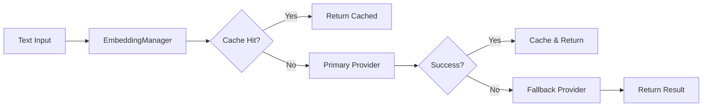

# Indexer Embeddings Configuration

## Overview

The indexer service supports multiple embedding providers for semantic search functionality. Embeddings are vector representations of text that enable semantic similarity comparisons.

## Configuration Methods

### 1. Environment Variables (Recommended for Production)

```bash
# Use Orchestrator Provider (Recommended)
export ORCHESTRATOR_EMBEDDING_ENDPOINT="http://orchestrator:8080/api/embeddings"
export ORCHESTRATOR_API_KEY="your-api-key"  # Optional
export EMBEDDING_MODEL="text-embedding-3-small"  # Default
export EMBEDDING_DIMENSIONS="1536"  # Must match model

# Other settings
export SEMANTIC_STORE_MAX_DOCUMENTS="10000"
```

### 2. Configuration File

Copy `config.example.toml` to `config.toml` and customize the embeddings section.

## Supported Providers

### Orchestrator Provider (Production Ready)

Uses the orchestrator service's embedding API, which delegates to configured LLM providers.

**Advantages:**
- Production-ready with retry logic and failover
- Supports multiple models (OpenAI, Anthropic, etc.)
- Centralized API key management
- Built-in rate limiting and caching

**Configuration:**
```toml
[embeddings.orchestrator]
endpoint = "http://orchestrator:8080/api/embeddings"
api_key = "optional-api-key"
model = "text-embedding-3-small"
dimensions = 1536
```

**Supported Models:**
| Model | Dimensions | Speed | Quality | Cost |
|-------|------------|-------|---------|------|
| text-embedding-3-small | 1536 | Fast | Good | Low |
| text-embedding-3-large | 3072 | Medium | Better | Medium |
| text-embedding-ada-002 | 1536 | Fast | Good | Low |

### Mock Provider (Testing Only)

Generates deterministic embeddings for testing. **NOT suitable for production**.

**Configuration:**
```toml
[embeddings]
provider = "mock"
dimensions = 384
```

### Local Provider (Planned)

Will support local ONNX models for on-premise deployments.

**Planned Models:**
- all-MiniLM-L6-v2 (384 dims) - Fast, good for general use
- e5-large-v2 (1024 dims) - Slower, better quality
- bge-small-en (384 dims) - Optimized for retrieval

## Architecture



## Performance Considerations

### Caching

The embedding cache uses an LRU strategy with configurable TTL:

```toml
[embeddings.cache]
max_entries = 10000  # Maximum cached embeddings
ttl_secs = 3600      # Cache TTL in seconds
```

### Batch Processing

For optimal performance, use batch embedding:

```toml
[embeddings.batch]
size = 100          # Process up to 100 texts at once
timeout_secs = 30   # Request timeout
```

### Expected Latencies

| Provider | Single Text | Batch (100) |
|----------|-------------|-------------|
| Orchestrator (cached) | <5ms | <10ms |
| Orchestrator (uncached) | 50-200ms | 200-500ms |
| Mock | <1ms | <5ms |
| Local (planned) | 10-50ms | 100-300ms |

## Troubleshooting

### Common Issues

1. **"Local provider not yet implemented"**
   - Solution: Use Orchestrator provider or Mock for testing
   - Set `ORCHESTRATOR_EMBEDDING_ENDPOINT` environment variable

2. **"Failed to generate embedding"**
   - Check orchestrator service is running
   - Verify network connectivity
   - Check API keys if authentication is required
   - Review orchestrator logs for provider errors

3. **Dimension mismatch errors**
   - Ensure `EMBEDDING_DIMENSIONS` matches your chosen model
   - Rebuild index if changing models

4. **High latency**
   - Check cache hit rate in metrics
   - Consider increasing `cache.max_entries`
   - Use batch processing for multiple documents

### Monitoring

Key metrics to monitor:

- `indexer_embedding_cache_hits` / `indexer_embedding_cache_misses` - Cache effectiveness
- `indexer_embedding_latency_ms` - Provider latency
- `indexer_embedding_errors_total` - Provider failures
- `indexer_embedding_batch_size` - Batch processing efficiency

## Migration Guide

### From Hash-based Mock to Real Embeddings

1. **Set environment variables:**
   ```bash
   export ORCHESTRATOR_EMBEDDING_ENDPOINT="http://orchestrator:8080/api/embeddings"
   export EMBEDDING_MODEL="text-embedding-3-small"
   export EMBEDDING_DIMENSIONS="1536"
   ```

2. **Clear existing index:**
   ```bash
   # If using SQLite
   rm ./data/indexer.db
   
   # If using PostgreSQL
   psql -c "TRUNCATE TABLE documents, embeddings;"
   ```

3. **Restart indexer service:**
   ```bash
   docker-compose restart indexer
   ```

4. **Re-index your documents:**
   ```bash
   # Trigger re-indexing of your codebase
   curl -X POST http://localhost:9200/reindex
   ```

## Security Considerations

1. **API Keys**: Store in environment variables or secret management system
2. **Network**: Use TLS for production orchestrator connections
3. **Access Control**: Implement ACLs for sensitive document indexing
4. **Data Privacy**: Consider on-premise deployment with local models for sensitive data

## Future Enhancements

- [ ] Local ONNX model support
- [ ] Multi-lingual embedding models
- [ ] Fine-tuned domain-specific models
- [ ] Hybrid retrieval (dense + sparse)
- [ ] Cross-encoder re-ranking
- [ ] Incremental index updates